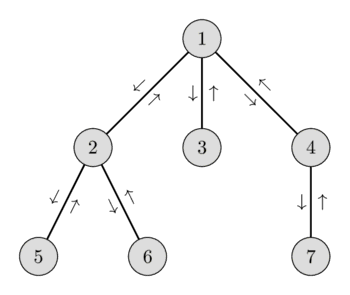

# ECE 208 Homework 3: Algorithms on Trees

## Problem 0: The TreeSwift Library
You will use [TreeSwift](https://niemasd.github.io/TreeSwift/) to do basic operations on trees. To install the package, use pip:

```python3 -m pip install treeswift```

TreeSwift is needed in this assignment and (almost) all the future assignments. Therefore, please carefully read the documentations and familiarize yourself to the package. In this assignment, you will use TreeSwift to implement some (non-trivial) algorithms on trees.

## Problem 1: Find an Euler Tour of the Tree
In graph theory, an Eulerian path is a path in a finite graph that visits every edge exactly once (allowing for revisiting vertices). An Eulerian cycle is an Eulerian path that starts and ends on the same vertex (source: [Wikipedia](https://en.wikipedia.org/wiki/Eulerian_path)). 
In a rooted tree T, if we replace each of its edge by a pair of directed edges from parent to child and vice versa, we get a directed graph G that is an augmented version of T. An Euler Tour of T is an Eulerian cycle of G starting and ending at the root vertex. 

Design an algorithm to find an Eulerian tour of a tree in linear time (with respect to the number of edges).

### Input:
T: TreeSwift Tree object. A rooted tree.

### Output:
  * E: list of strings. An Euler tour of T.
  * F: dictionary string -> int. Mapping each node label to its first occurence in E.
  * H: dictionary string -> int. Mapping each node label to its height (i.e. number of edges on the path from this node to the root).

For example, for the following tree, the desired outputs are:
  * E = [1, 2, 5, 2, 6, 2, 1, 3, 1, 4, 7, 4, 1]
  * F = {1:0, 2:1, 3:7, 4:9, 5:2, 6:4, 7:10}
  * H = [1:0, 2:1, 3:1, 4:1, 5:2, 6:2, 7:2}


  
  

### Hint:
You may find the [Depth-first search (DFS)](https://en.wikipedia.org/wiki/Depth-first_search) technique useful here. The Euler tour is also related to other types of [tree traversals](https://www.geeksforgeeks.org/tree-traversals-inorder-preorder-and-postorder/) such as post-order, pre-order, and in-order. You are welcome to use any kind of tree traversals available in TreeSwift, or implement your own.


## Problem 2: LCA Revisited
In homework 1, you have designed a dynamic programming algorithm to find the LCA for all pairs of nodes in a DAG. Now you will revisit the LCA problem and design a new algorithm that is more specialized for trees. 
When working with trees and apply to phylogenetics, we sometimes see the need to query the LCA of a set of nodes (contains two or more nodes) and repeat the task for a large number of queries. 
In this case a naive algorithm that processes each query independently takes O(n<sup>2</sup>) per query (in the worst case: a caterpillar tree with the length of each query is n). Therefore, it takes O(n<sup>2</sup>k) time to answer k queries, which is very inefficient.
In this part of the assignment, you will design a new algorithm for the purpose of *multi-query optimization*, where you trade the preprocessing time for the query time (i.e. think about doing a huge number of rounds of *linear search* on an unsorted list versus sorting the list first, then doing that many rounds of *binary search*).

Design an algorithm to solve the multi-query LCA problem that costs at most O(nlogn) for preprocessing time and O(m+) per query of length m on a tree of n nodes.

### Input:
  * T: TreeSwift Tree object. A rooted tree.
  * Q: list of lists of strings. Each element q in Q is a list of node labels of T.
### Output:
  * LCA: list of strings. Each string LCA[i] is the answer to the query Q[i].

### Hint:
The Euler tour you found in problem 1 offers a new way to represent a rooted tree T, known as the [Euler tour technique](https://en.wikipedia.org/wiki/Euler_tour_technique) (ETT). The ETT enables the design of efficient algorithms for a wide set of problems in trees, including the LCA querying problem that we are considering.

Suppose we want to find the LCA of two nodes u and v. Consider the part of the Euler tour between the first visit of u and the first vist of v. Convince yourself that the LCA of u and v is the vertex with the lowest height on this part of E. Thus, the LCA(u,v) can be uniquely determined by finding the vertex with the smallest height in the Euler tour between F[u] and F[v] (recall that F is one of the outputs you produce to solve problem 1). You can easily generalize this idea to a set of more than 2 nodes by considering the part of E from min(F[u]) to max(F[u]) for all u in the query set.

For example, suppose you want to query LCA(6,4) in the example tree (see the figure in problem 1). Then the part of the Euler tour you need to consider is [6,2,1,3,1,4], among which node 1 has the lowest height (see the table below). Thus, LCA(6,4) = 1. 

| Vertices | 1 | 2 | 5 | 2 | 6 | 2 | 1 | 3 | 1 | 4 | 7 | 4 | 1 |
|-|-|-|-|-|-|-|-|-|-|-|-|-|-|
| Heights | 0 | 1 | 2 | 1 | 2 | 1 | 0 | 1 | 0 | 1 | 2 | 1 | 0 |

Thus, the LCA problem is reduced to the **[Range Minimum Query (RMQ)](https://en.wikipedia.org/wiki/Range_minimum_query)** problem, which can be solved efficiently using *one of* the following specialized data structures:
 * [Sqrt Decomposition](https://cp-algorithms.com/data_structures/sqrt_decomposition.html)
 * [Segment Tree](https://cp-algorithms.com/data_structures/segment_tree.html)
 * [Sparse Table](https://cp-algorithms.com/data_structures/sparse-table.html)

## Problem 3: Compute Tree Diameter
Now we consider a classical problem in graph theory that has applications to phylogenetics: computing tree diameter. In a rooted tree with positive weighted edges, a diameter is (one of) the longest path(s) between any pair of leaves, where the length of the path between two nodes (u,v) is the sum of the edges that pass through u and v. 

Design a linear-time algorithm (i.e. O(n) where n is the number of vertices) to find (one of) the diameter(s) of the tree.

### Input: 
T: TreeSwift Tree object. A rooted tree with positive branch lengths.

### Output:
   * P: list of strings. A path connecting two nodes in T that forms a diameter.
   * d: float. The length of the diameter.

## Starting code
* **[euler_tour.py](euler_tour.py):** Given to you. This script handles input/output for problem 1. Please **DO NOT** modify it. 

```python3 euler_tour.py <newick_tree> <output_file>```

* **[LCAs.py](LCAs.py):** Given to you. This script handles input/output for problem 2. Please **DO NOT** modify it. 

```python3 LCAs.py <newick_tree> <query_file> <output_file>```

* **[compute_diameter.py](compute_diameter.py):** Given to you. This script handles input/output for problem 3. Please **DO NOT** modify it. 

```
python3 compute_diameter.py <newick_tree> <output_file>
```

* **[treelib/todo.py](treelib/todo.py):** You will complete the TODO in functions ```euler_tour```, ```find_lcas```, and ```compute_diameter```.
* **[autocheck.py](autocheck.py):** Given to you. Please **DO NOT** modify. This script automatically runs some basic tests for your program. To run, simply type

```
python3 autocheck.py
```
To test each problem independently, you can instead use ```autocheck_euler.py```, ```autocheck_lcas.py```, or ```autocheck_diameter.py```.

The tests by `autocheck.py` will also be run by "Github Actions" everytime you push your code to the Github repository, so be sure to check the "Actions" tab of your repository to see if the tests passed.

You can find all the test cases under [testing/test_data/checking/](testing/test_data/checking/). 

## Deliverables:
* Programming: [treelib/todo.py](treelib/todo.py)
* Writeup: **writeup_<YOUR_PID>.pdf**: description, proof of correctness, and complexity analyses of your algorithms to solve problems 1, 2, and 3.

## Grade Breakdown (100 Points)
* **Problem 1: 35 Points**
    * Programming: 20 Points
      * 20 test cases, 1 pt each
      * Time limit per test: 30 seconds
    * Algorithm analysis: 15 Points
      * Proof of correctness: 7.5 Points
      * Proof of linear-time complexity: 7.5 Points
      * *Note:* Your algorithm must scale linearly with the number of edges in the tree. Higher-order complexity will NOT get any credit.        
* **Problem 2: 40 Points**
    * Programming: 20 Points
      * 20 test cases, 1 pt each
      * Time limit per test: 30 seconds
    * Algorithm analysis: 20 Points
      * Proof of correctness: 10 Points
      * Complexity analysis: 10 Points
      * *Note:* To get full credit, your algorithm in the worst case must be O(nlogn) for preprocessing time and O(m+) per query of length m (or better)
* **Problem 3: 45 Points**
    * Programming: 20 Points
      * 20 test cases, 1 pt each
      * Time limit per test: 30 seconds
    * Algorithm analysis: 25 Points
      * Proof of correctness: 12.5 Points
      * Proof of linear-time complexity: 12.5 Points
      * *Note:* To get full credit, your algorithm must scale linearly with the number of edges in the tree. Higher-order complexity may get partial credits on a case-by-case basis.        

**Note that the final grade will be scaled by 1/1.2 to make sure the total points are 100.**

## Restrictions on the usage of the TreeSwift library
* For problem 2, you **MUST NOT use the "mrca" method in TreeSwift**. 
* For problem 3, you **MUST NOT use the "diameter" method in TreeSwift**. 
* No other external library or software tool is accepted in this assignment.
